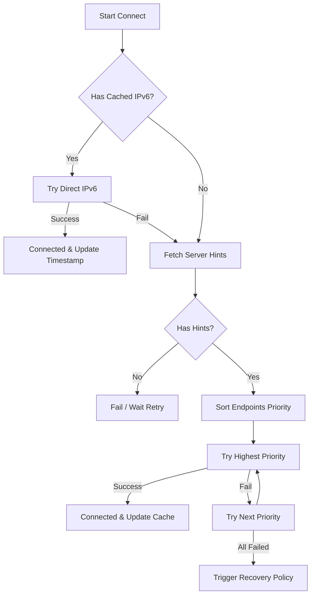

# Connection & Recovery Strategy

## Overview

This document outlines the connection establishment, prioritization, and recovery strategy for iTerm2 remote streaming.

**Key Principles:**
1. **Signaling Reliability**: Use WebSocket/HTTPS over a reliable cloud channel for initial signaling (offer/answer/candidates) and address synchronization.
2. **Direct-First**: Always prefer direct peer-to-peer connections (IPv6/Tailscale/LAN) to minimize latency and server cost.
3. **Cache-First**: Cache last known successful addresses (especially IPv6) locally to enable direct reconnection without waiting for server round-trips.
4. **Resilient Recovery**: Implement smart backoff and state recovery to handle network switches and backgrounding gracefully.

## 1. Addressing & Payload Schema

Host and client exchange a structured, extensible payload via the cloud signaling server.

**Device Identity:**
- `deviceId = "{accountId}:{stableId}"` (Ensures uniqueness and stability across installs)

**Connection Payload (JSON Schema):**
```json
{
  "deviceId": "acc123:stable456",
  "version": 1,
  "timestamp": 1700000000000,
  "endpoints": [
    {
      "type": "ipv6_global",
      "address": "[2001:db8::1]",
      "port": 5000,
      "priority": 100
    },
    {
      "type": "tailscale_v6",
      "address": "[fd7a:115c:a1e0::1]",
      "priority": 90
    },
    {
      "type": "tailscale_v4",
      "address": "100.100.100.100",
      "priority": 85
    },
    {
      "type": "lan_ipv4",
      "address": "192.168.1.50",
      "port": 5000,
      "priority": 50
    },
    {
      "type": "relay_turn",
      "uri": "turn:turn.example.com",
      "priority": 10
    }
  ]
}
```

## 2. Connection Priority (Orchestrator Logic)

The client connection orchestrator attempts connections in the following order:

1.  **Cached Direct IPv6**:
    - **Source**: Local `Ipv6AddressBook` (persisted from previous successful sessions).
    - **Pros**: Lowest latency, no NAT traversal issues, works without server if cache is valid.
    - **Fallback**: If fails or cache expired -> proceed to Step 2.

2.  **Tailscale (v6/v4)**:
    - **Source**: Cloud payload sync.
    - **Pros**: Secure, reliable NAT traversal (built-in DERP fallback).
    - **Note**: Tailscale provides a flat mesh network, often more reliable than raw LAN.

3.  **LAN IPv4**:
    - **Source**: Cloud payload sync (local discovery).
    - **Pros**: Low latency if on same subnet.
    - **Cons**: NAT/Subnet issues, unstable IP assignment.

4.  **Cloud Relay (TURN)**:
    - **Source**: Cloud payload (TURN server credentials).
    - **Pros**: Reliability (works through symmetric NATs).
    - **Cons**: Higher latency, bandwidth cost.

## 3. Recovery Strategy (ServerRecoveryPolicy)

Handles network interruptions, app backgrounding, and signaling failures.

**State Machine Inputs:**
- Trigger: App Resumed / Transport Disconnected / Negotiation Failed
- Context: Transport State, Session Health, Cached IPv6 Availability, Last Success Time

**Policy Rules:**
1.  **Stop on Healthy**: If session is healthy (connected & flowing), stop recovery.
2.  **Resume Gating**: On `AppResumed`, only trigger recovery if backgrounded > `minBackgroundForKickMs` (e.g., 8s).
3.  **Throttle**: Enforce `minKickIntervalMs` (e.g., 1.8s) between recovery attempts.
4.  **Direct-First Attempt**: On first recovery attempt, if `Ipv6AddressBook` has valid entry -> try direct connect (bypass server).
5.  **Backoff Schedule**: If failures persist -> 5s -> 9s -> 26s (capped).
6.  **Transport Reconnect**: If signaling transport is down, reconnect it before attempting negotiation (unless trying cached direct).

## 4. Local Simulation Architecture

To ensure robustness without requiring a full server environment for every test, we implement a **Local Negotiation Orchestrator**:

- **`FakeSignalingTransport`**: Simulates server latency and payload exchange.
- **`FakePeerConnection`**: Simulates WebRTC connection states (New -> Checking -> Connected/Failed).
- **`ConnectionOrchestrator`**:
    - Manages the state machine.
    - Selects endpoints based on priority.
    - Triggers `ServerRecoveryPolicy` on failures.
    - Updates `Ipv6AddressBook` on success.

**Flow:**

